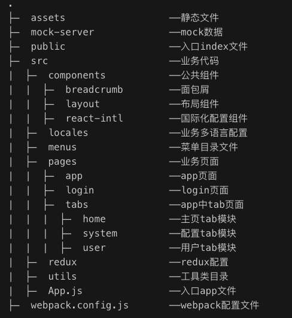

# antd + react + redux + webpack4 + react-router4基础框架

---

## 预览地址：https://awesome-goldstine-efd4b4.netlify.com/#/app/exchange

## 说明

该基础框架采用第三方依赖包都是目前最新版本，结合antd的UI框架，实现主题定制，webpack自主配置，动态菜单路由设计，redux数据管理，国际化多语言，错误统一处理，本地mock服务等功能。

设计原则：

1）开放性：秉承自由开放精神，绝对不会给大家造任何的黑盒子（啥叫黑盒子，就是它规定你怎么写，你就得怎么写，它不更新，你也休想正常使用，当然除了react,antd等第三方框架），项目中数据管理（伪dva），webpack配置，动态路由设计等，都是采用自由开放思想，大家可根据自己实际项目需要自行修改。

2）多选择性：该框架有目前存在多个版本供大家选择
> 1）test分支（min版本，里面只有静态菜单路由，数据管理，按需加载几个简单功能，适合小型项目）
>
> 2）master分支（默认，稳定版本）
>
> 3）develop分支（开发版本，最新的版本）
>
> 4）pre分支（健全版本，由min版本升级后的第一个版本，功能相对健全）

功能说明：
+ [1.菜单配置](#function.menus)
+ [2.动态路由](#function.route)
+ [3.权限控制](#function.perm)
+ [4.数据管理](#function.data)
+ [5.按需加载](#function.lazy)
+ [6.国际化语言](#function.intl)
+ [7.本地mock服务](#function.mock)
+ [8.路径alias别名](#function.alias)
+ [9.错误统一处理](#function.error)
+ [10.安全CSRF防范](#function.csrf)
+ [11.导出当前页](#function.export)

## 初始化项目
```bash
$ npm i generator-antd-custom -g
$ cfe init react
```

## 切换至指定版本分支（需要用git初始化项目）
```bash
$ git init
$ git clone https://github.com/ctq123/antd-custom.git
$ git checkout N
N = test || develop || pre
```

## 运行

```bash
$ npm start
```
or
```bash
$ npm run dev
```
## 打包

```bash
$ npm run build:test
```
or
```bash
$ npm run build:prod
```

## 结构说明


## 语法规范说明
 1.针对tabs业务模块，不再使用文件名称代表某个业务模块，建议使用目录名称替代。比如主页模块，目录名称home就代表home业务模块，home目录下采用index.js作为模块入口

 2.由于react已经采用react16.9版本，切勿继续使用componentWillMount和componentWillReceiveProps等即将要废弃的生命周期，免得要在react17版本中增加维护成本 

 ... 

## 功能说明
+ [1.菜单配置](#function.menus)
+ [2.动态路由](#function.route)
+ [3.权限控制](#function.perm)
+ [4.数据管理](#function.data)
+ [5.按需加载](#function.lazy)
+ [6.国际化语言](#function.intl)
+ [7.本地mock服务](#function.mock)
+ [8.路径alias别名](#function.alias)
+ [9.错误统一处理](#function.error)
+ [10.安全CSRF防范](#function.csrf)
+ [11.导出当前页](#function.export)


### <span id="function.menus">1.菜单配置</span>
新增一个菜单需要两个步骤： 

1）在menus中的menu.data.js文件中添加新菜单，其中key和path都是唯一值（其中permKey是权限字段，[权限控制](#function.perm)中会介绍）

2）在对应的tabs模块下添加index.menux.js文件配置，其中key和path要与步骤1中保持一致（其中routeProps是路由属性，[动态路由](#function.route)中会介绍）

涉及范围：
> menus/menu.data.js
>
> tabs/../index.route.js

### <span id="function.route">2.动态路由</span>
项目中采用[react-router4](https://reacttraining.com/react-router/)管理路由，路由又分为静态路由和动态路由

1）静态路由：src/App.js中转跳app页面和login页面采用的是静态路由设计，它属于页面层级，并不会因为用户权限的差异而不同

2）动态路由：pages/app/index.js中采用的是动态生成路由，它会因为用户权限的不同而存在差异

动态生成路由逻辑：
> 1）先去pages/tabs业务目录下查找出所有业务模块index.route.js文件
>
> 2）根据index.route.js查找routeProps属性生成Route
>
> 3）根据传入用户菜单列表的menuList查找父级菜单下的第一个子菜单生成Redirect（业务需求：点击父级菜单路由会转跳至第一个有效子菜单）
>
> 详情：menus/menu.route.js

涉及范围：
> pages/app/index.js
>
> menus/menu.route.js
>
> tabs/../index.route.js

app内菜单处理技术方案：
> 1）路由转跳方案：点击菜单加载tab页面文件，转跳到对应的路由并渲染页面，本项目采用的是路由转跳处理方案
>
> 2）新增tab方案：点击菜单加载tab页面文件，新增tab渲染页面，若采用该技术实现方案，可将上述涉及范围删除


### <span id="function.perm">3.权限控制</span>
用户登陆成功后，会向后端获取用户权限列表，是一个权限key值的列表，分为菜单权限和功能权限

1）菜单权限：
在menus/menu.data.js路由中配置permKey值，获取到用户权限列表后，重新生成新的菜单列表

2）路由权限：
在index.route.js路由中配置permKey值，获取到用户权限列表后，重新生成新的路由列表

3）功能权限：
若页面中存在某个按钮只有某些角色（权限）才能看到，根据用户权限列表判断是否需要显示该按钮，如tabs/example模块


涉及范围：
> pages/app/index.js
>
> menus/menu.data.js
>
> menus/menu.permission.js
>
> utils/permission.js
>
> tabs/../index.route.js

更多权限技术方案：
> 1）前后端结合方案：用户登陆后，获取用户权限列表，前端根据用户权限列表生成相应的菜单，但需要前端配置菜单权限key值；
>> 优势：路由权限和功能权限可以一次性获取
>
> 2）后端判断方案：用户登陆后，后端判断该用户权限，直接返回菜单列表，前端直接显示
>> 优势：前端不需要重新生成菜单，也不需要配置权限key值
>> 劣势：若有菜单内颗粒度更小的按钮功能等权限时，还需要再次向后端获取权限列表值，判断是否需要显示

### <span id="function.data">4.数据管理</span>
数据管理采用的是[redux](https://www.redux.org.cn/)+[redux-saga](https://redux-saga-in-chinese.js.org/)方案，这里参考dva的部分设计思想，自己重新生成一套数据管理方案，使用方法与dva非常相似

如果你还不熟悉[redux](https://www.redux.org.cn/)和[redux-saga](https://redux-saga-in-chinese.js.org/)，请自行学习和了解

如果你不想了解它们，那也没关系，按照以下两个步骤使用即可，不过我还是建议你抽空学习并掌握它们

新增一个菜单数据管理需要两个步骤：

以tabs/home模块为例

1）在home模块下创建一个index.model.js文件，其包含四个属性name, state, reducers, effects。
> name: model名称，model中的name需要保持唯一，它是挂在store下state对应的key值
>
> state: 初始state状态
>
> reducers: reducer纯函数对象
>
> effects: [redux-saga](https://redux-saga-in-chinese.js.org/)处理异步请求的副作用对象

2）在home/index.js文件中使用connect()引入该模块的state属性，即步骤1中的name，它对全局有效

> 说明：reducers和effects函数的key，最好以步骤1中的name开头，调用时业务清晰明了，同时方便后期全局的搜索和维护

涉及范围：
> pages/../index.model.js
>
> pages/../index.js
>
> redux/*

核心设计思想：
> 1）遍历pages/*目录下index.model.js找出{name, state, reducers}，并将其重新整合生成redux的reducer
>
> 2）遍历pages/*目录下index.model.js找出effects，将其重新整合生成redux-saga
>
> 更多详情请看[redux最佳实践的前世今生2](https://github.com/ctq123/blogs/issues/2)

**redux建议使用场景** 
> 1.兄弟组件之间通信，不建议在直接父子组件中滥用redux
>
> 2.跨多层父子组件之间通信，比如爷爷和孙子，曾祖父和曾孙等。redux原理之一就是基于这个来做的。
>
>>理论上，在index.js中直接使用axios处理异步已满足百分之九十业务场景了，比如user模块； 
>>
>>只有一些跨兄弟组件通信或者跨多层父子组件才需要使用redux，比如login模块；
>>
>>home模块中的示例只是为了方便介绍redux的使用方法，故意而为之

### <span id="function.lazy">5.按需加载</span>
按需加载处理方案：

1）采用require.ensure()处理

2）采用react.lazy()处理，react16.6引入，利用import()原理处理懒加载，暂时还不支持服务器渲染

3）采用[loadable-components](https://github.com/smooth-code/loadable-components)处理，支持服务器渲染，也是react官方推荐处理服务器渲染方案。

后面两种方案都是采用[import()](https://zh-hans.reactjs.org/docs/code-splitting.html#import)原理进行代码切割，并使用promise进行异步加载。

由于本项目不涉及服务器渲染，采用第二种技术方案，更重要的是它是react原生官方的，是亲生儿子，比任何第三方插件都可靠。

### <span id="function.intl">6.国际化语言</span>

目前处理国际化语言最流行的两种解决方案是[react-intl](https://github.com/formatjs/react-intl/blob/master/docs/Components.md)和[i18n](https://lingui.js.org/ref/react.html#component-I18nProvider)

本项目采用的是antd官方使用的一套国际化插件，[react-intl3](https://github.com/formatjs/react-intl/blob/master/docs/Components.md)，也是非常流行的一套解决方案，但目前网上的文章多是react-intl2的，react-intl3配置和使用方法均出现了较大的变化，具体可看官网。

react-intl有两种使用方法：
>1）dom场景：直接生成HTML对应的翻译文本dom，如home模块(home/index.js) 
>
>2）字符串场景：直接生成string字符串翻译文本字符串，如user模块(user/index.js)

实际使用场景中需要在locales/目录下配置对应的key-value值，通过引用key来显示对应的文字

涉及范围：
> src/components/react-intl/*
>
> locales/*
>
> pages/../index.js
>
> src/components/*

### <span id="function.mock">7.本地mock服务</span>
这里采用的是一个外部插件cf-mock-server作为本地mock服务，具体配置可在webpack中配置

webpack.config.js
```js
module.exports = {
  //...
  devServer{
  //...
    after: (app, server) => {
      app.use(mock({
        config: path.join(__dirname, './mock-server/config.js')
      }))
    },
  }
}
```
然后创建mock-server文件夹及其配置文件config.js，最后在config.js配置对应的接口API以及对应json文件数据即可，具体可看home模块的例子

涉及范围：
> mock-server/*

### <span id="function.alias">8.路径alias别名</span>
通过创建import或require的别名，来确保模块的引入变得更简单。

webpack.config.js
```js
module.exports = {
  //...
  resolve: {
    alias: {
      '@assets': path.join(__dirname, 'assets'),
      '@src': path.join(__dirname, 'src'),
      '@components': path.join(__dirname, 'src/components'),
      '@utils': path.join(__dirname, 'src/utils'),
      '@menus': path.join(__dirname, 'src/menus'),
      '@locales': path.join(__dirname, 'src/locales'),
    }
  }
}
```
通常我们使用的编辑器是vscode，上述只对webpack有效，vscode编辑器它并不知道，command+点击并不会发生转跳，因此需要添加jsconfig.json配置

jsconfig.json
```js
{
  "compilerOptions": {
    "checkJs": false,
    "allowSyntheticDefaultImports": true,
    "baseUrl": ".",
    "paths": {
      "@assets/*": ["assets/*"],
      "@src/*": ["src/*"],
      "@components/*": ["src/components/*"],
      "@utils/*": ["src/utils/*"],
      "@menus/*": ["src/menus/*"],
      "@locales/*": ["src/locales/*"],
    }
  },
}
```

### <span id="function.error">9.错误统一处理</span>
我们采用axios作为通信处理方式，在应用页面初始化时，设置axios，并对url返回进行拦截处理，若出现错误异常，会出现两种场景，一种是网络错误，一种是业务错误

1）网络错误：网络请求状态为401，404，503等错误，并提示对应的信息。

2）业务错误：这种没有网络异常（即返回状态为200），通常后端返回的数据都会经过一层包装，若数据中存在success的状态，若为false，即发生了业务异常，需要对其进行特殊处理。本项目中业务异常返回到各模块中进行处理，在拦截层做统一处理，若成功直接返回真正可用的data数据；若失败，先提取后端返回的错误信息，并与原始数据一起直接返回给view层，至于如何处理错误，由view层自己决定

涉及范围：
> utils/handleAxios.js

### <span id="function.csrf">10.安全CSRF防范</span>
安全方面，我们采用token验证的方式解决

我们通过设置withCredentials携带cookie，前端登陆成功后，我们会从cookie中获取token值，并在axios请求的header中统一设置Authorization字段为token值，以后所有的请求的头部都会带上该Authorization字段，后端根据该字段与后端保存的token进行验证判断该请求是否合法

涉及范围：
> utils/handleAxios.js

### <span id="function.export">11.导出当前页</span>
采用xlsx依赖包，它比file-saver更出色，提供多种导出文件格式并且提供样式导出，比如合并单元格等

对antd的columns进行解析和封装，使用时直接调用方法即可，优雅简单，不需要其他配置

涉及范围：
> utils/exportTableData.js
>
> utils/download-file.js

